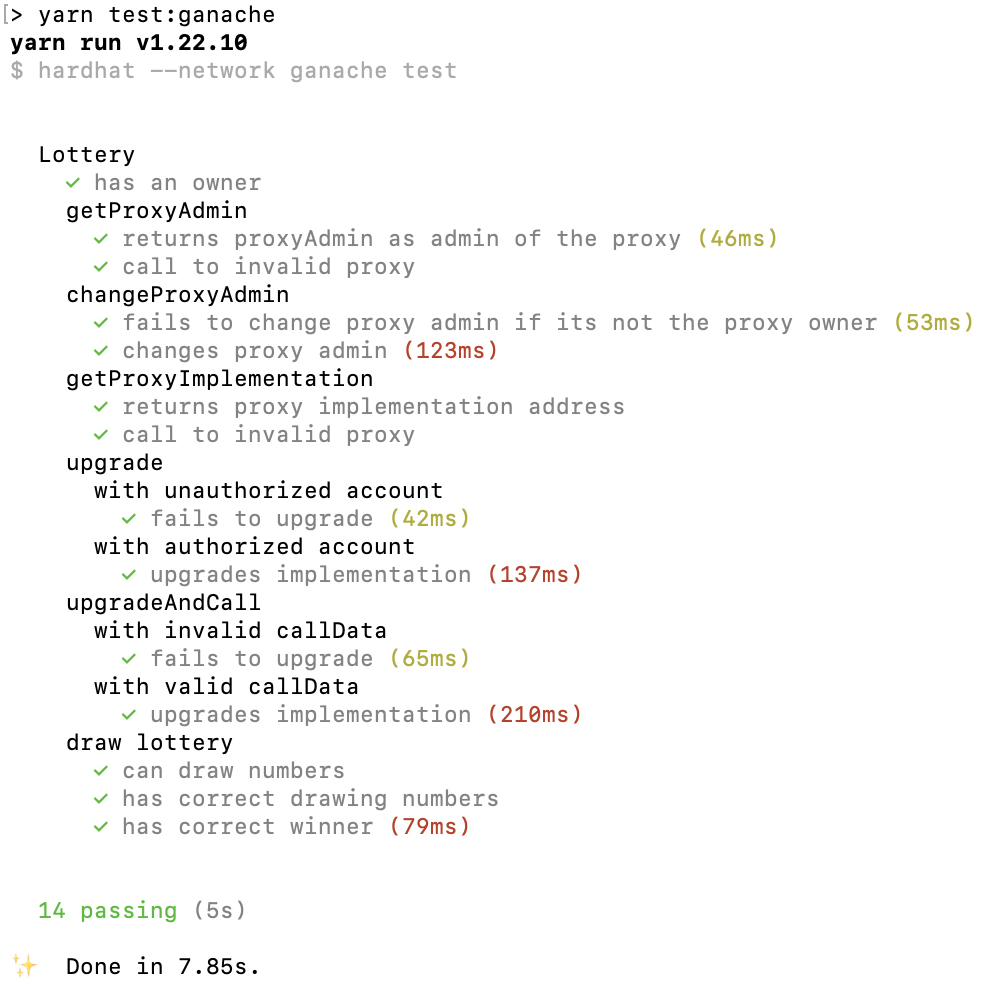

## Lottery

* 已把彩票与升级合约整合在一起, 也写了测试脚本通过测试
* web3.js React 兑奖页面稍后补上

```
Node.js v14.16.0
Yarn v1.22.10
Solidity v0.8.3
```

### Installation

```console
$ yarn
```

### Compile

```console
$ yarn compile
```

### Testing

```console
$ yarn test          # without ganache
$ yarn test:ganache  # with ganache
```


